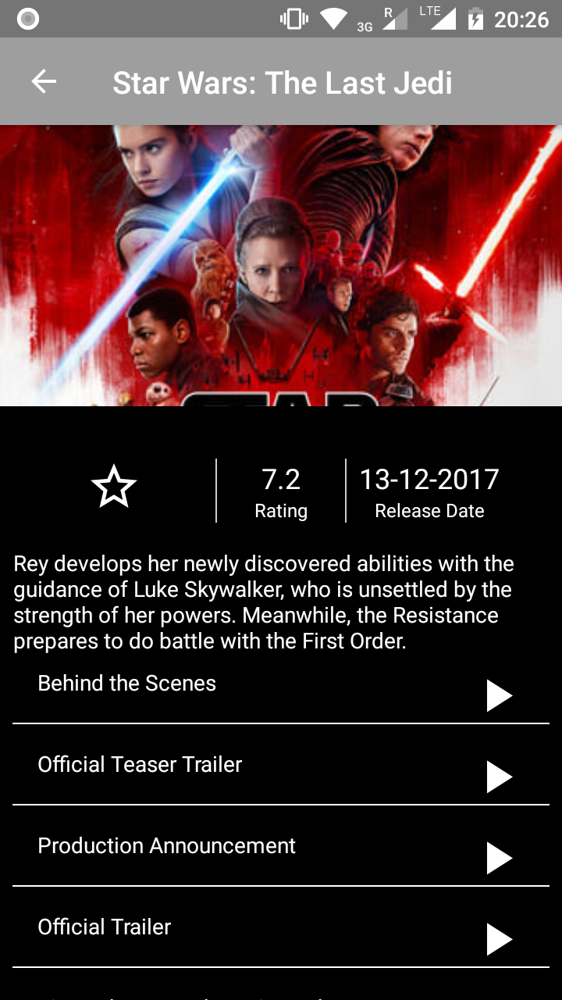
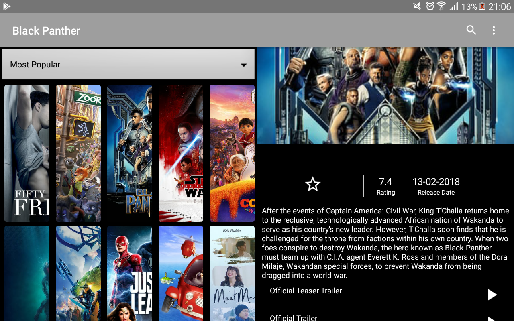
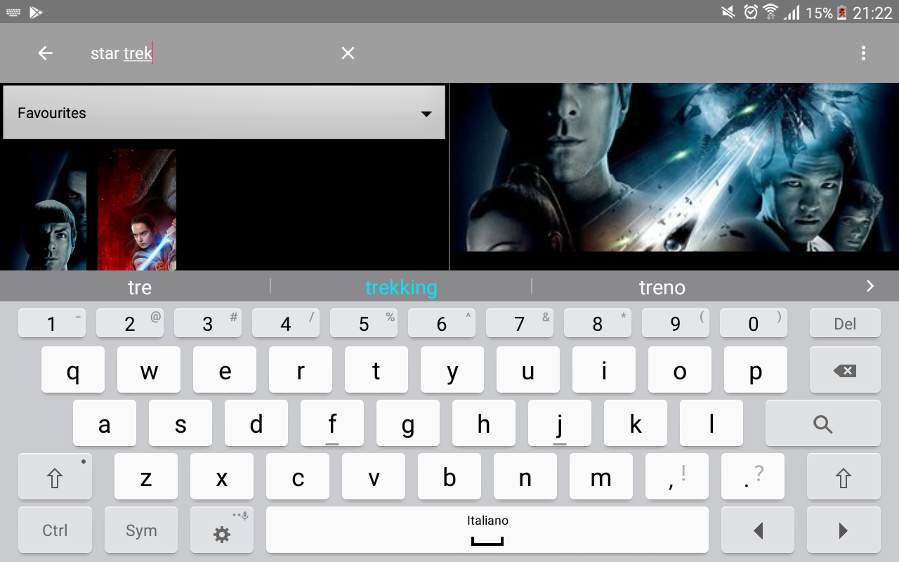

# PopularMovies2

## About 
Project 3 Udacity Android Developer Nandegree. The App queries TheMovieDb API to retrieve data using Retrofit.
To create this app, I applied Architecture Components: MVVM, Dependency Injection with Dagger 2, LiveData, DataBinding.
In addition, I added an animation when the RecyclerView is scrolled up and down and implemented a Dual Pane version for tablets.

**Features:**

- Query Most Popular and Top Rated Movies
- Search for Movies
- Watch Trailers
- Read Overview and Reviews
- Save Favourite Movies on the phone
- Optime for tablet in Dual Pane mode

## Video
https://youtu.be/i0fxP6C8zi8

## Screenshots
    

License
-------
  Copyright 2018 Lorenzo Redaelli

    Licensed under the Apache License, Version 2.0 (the "License");
    you may not use this file except in compliance with the License.
    You may obtain a copy of the License at

       http://www.apache.org/licenses/LICENSE-2.0

    Unless required by applicable law or agreed to in writing, software
    distributed under the License is distributed on an "AS IS" BASIS,
    WITHOUT WARRANTIES OR CONDITIONS OF ANY KIND, either express or implied.
    See the License for the specific language governing permissions and
    limitations under the License.

